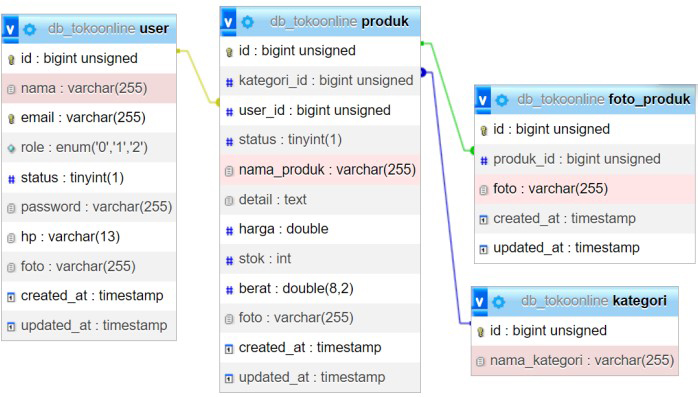
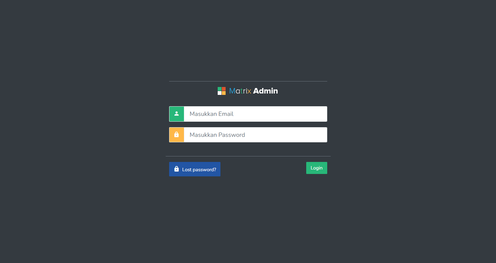
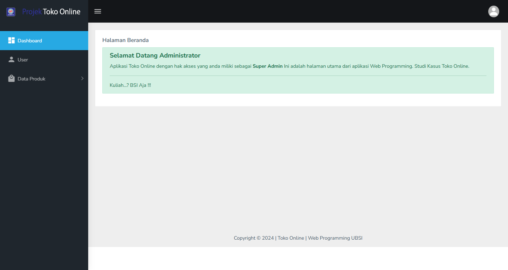
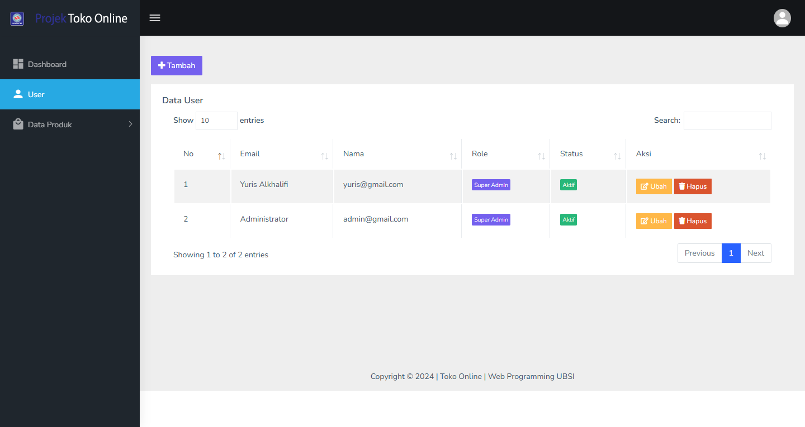
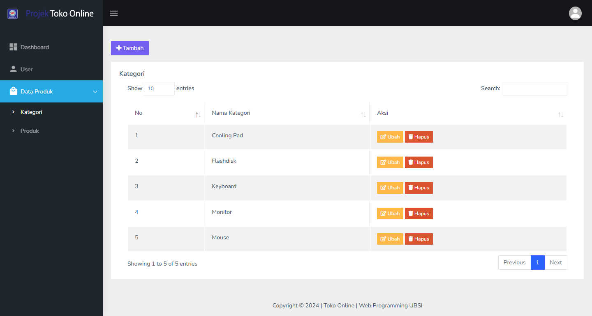
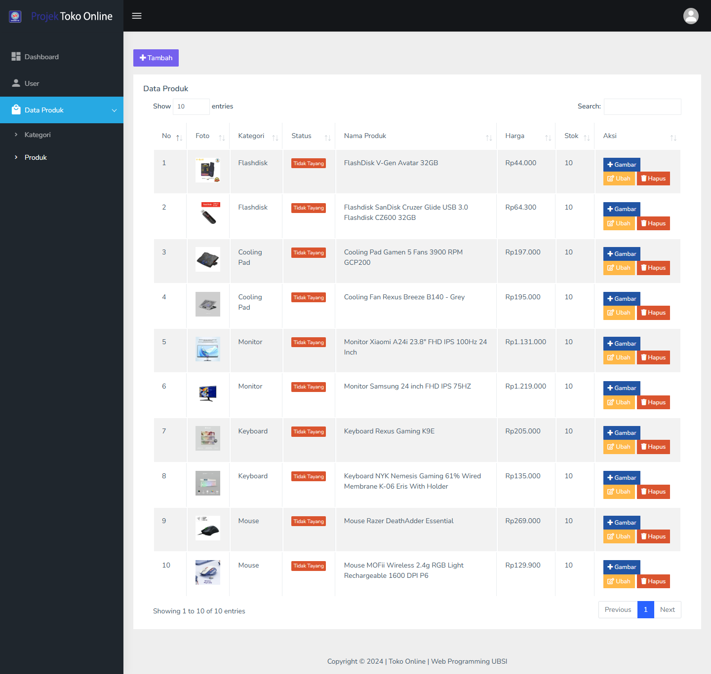
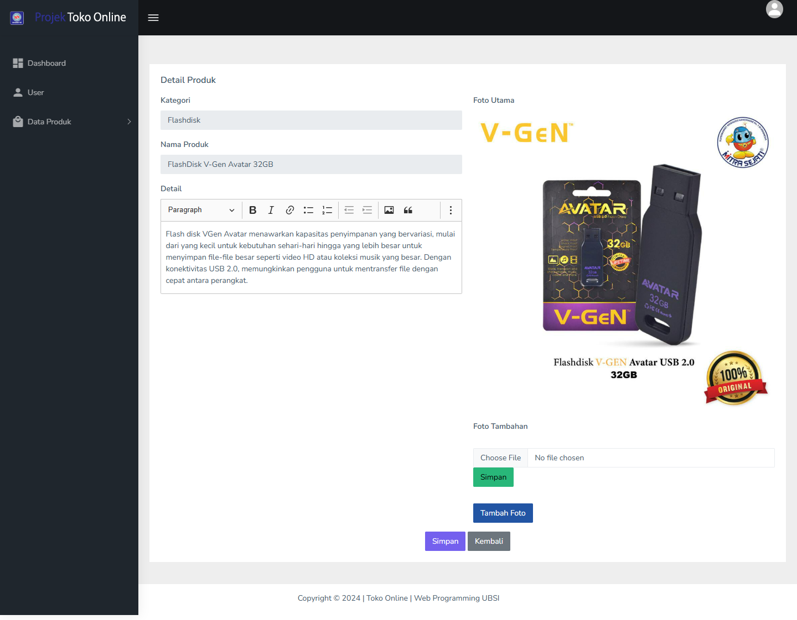

<p align="center"><a href="https://laravel.com" target="_blank"></a></p>
<p align="center" style="background-color: #000"><a href="https://laravel.com" target="_blank"></a></p>


## Pengenalan Project

Project ini merupakan project Laravel pada mata kuliah Web Programming II di Universitas Bina Sarana Informatika yang bertemakan tentang Toko Online.

## Relasi Tabel
<p align="center"><a href="https://laravel.com" target="_blank"></a></p>

## Cara Install
1. Cloning repository ini melalui terminal.
```
git clone https://github.com/yuris60/TokoOnline.git
```
2. Tunggu hingga selesai cloning, lalu inisiasi dependensi composer.
```
composer install
```
3. Duplikat file `.env.example` menjadi `.env` dan konfigurasikan koneksi database menjadi seperti ini
```
DB_CONNECTION=mysql
DB_HOST=127.0.0.1
DB_PORT=3306
DB_DATABASE=db_tokoonline
DB_USERNAME=root
DB_PASSWORD=
```
4. Generate key aplikasi pada env melalui terminal
```
php artisan key:generate
```
5. Migrasikan tabel beserta seeder melalui terminal
```
php artisan migrate:fresh --seed
```

## Screenshot
<table width="100%">
<tr>
<td><h3 align="center">Login</h3></td>
<td><h3 align="center">Home</h3></td>
</tr>
<tr>
<td><h3 align="center">User</h3></td>
<td><h3 align="center">Kategori</h3></td>
</tr>
<tr>
<td><h3 align="center">Produk</h3></td>
<td><h3 align="center">Tambah Foto Produk</h3></td>
</tr>
</table>

## Licensi

Project ini mengacu pada modul praktik dari mata kuliah Web Programming II Universitas Bina Sarana Informatika (UBSI). Project ini bersifat open-source untuk edukasi.
<blockquote>Kuliah...? BSI AJA !!</blockquote>
